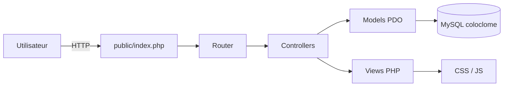
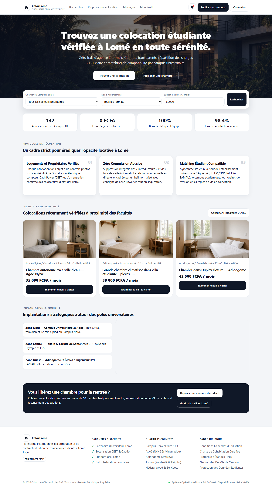
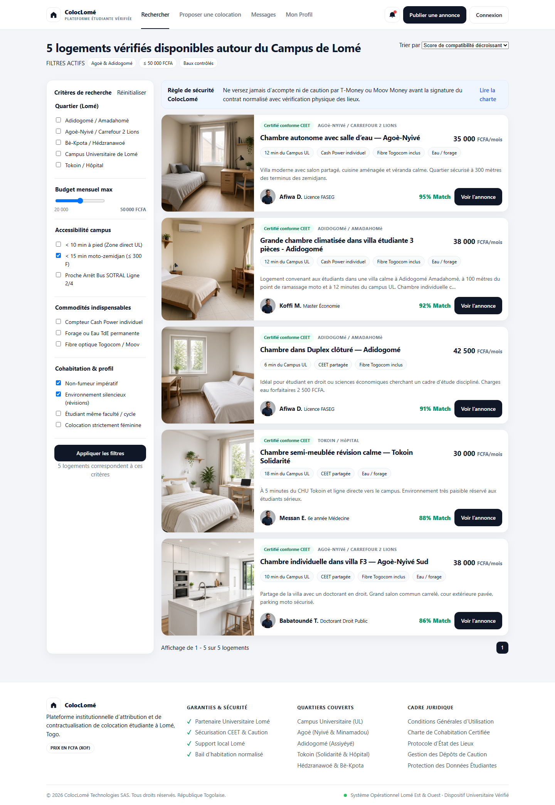
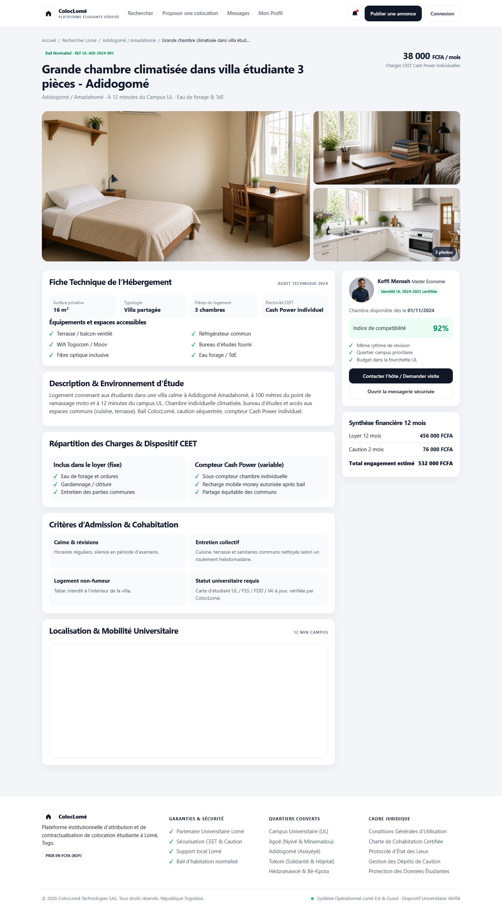
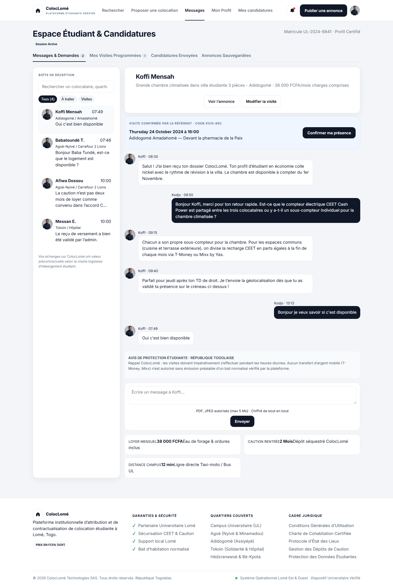
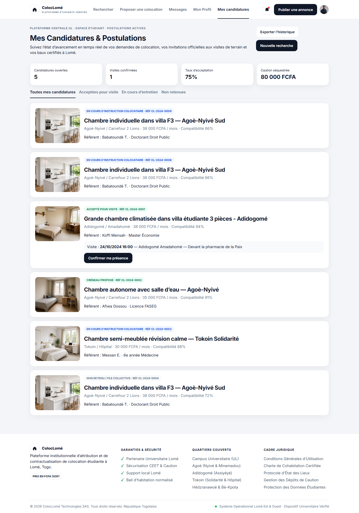
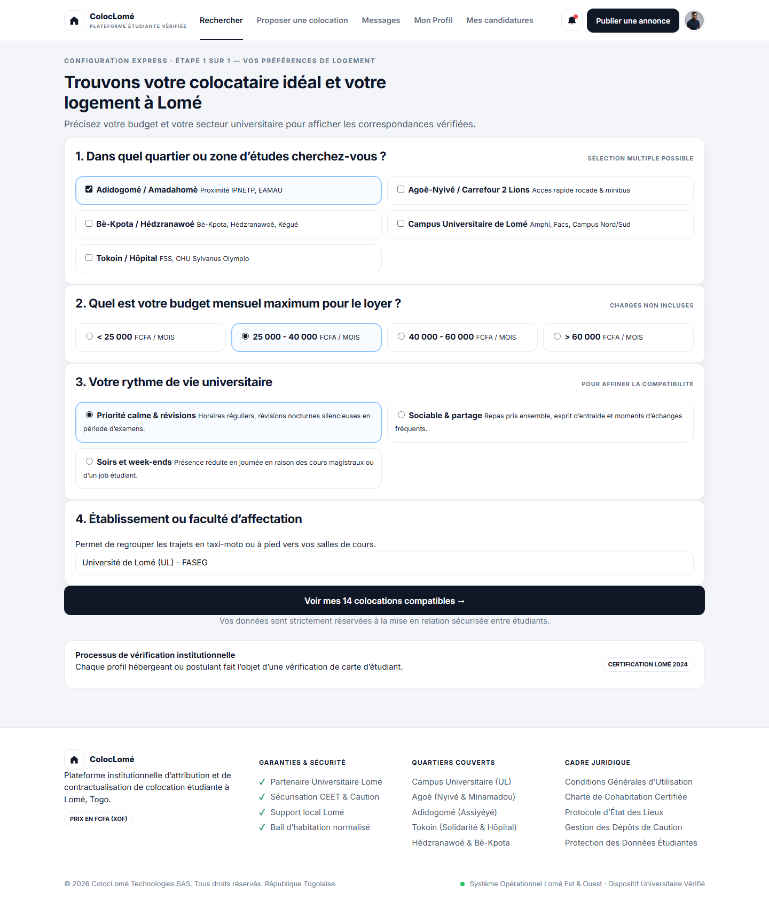
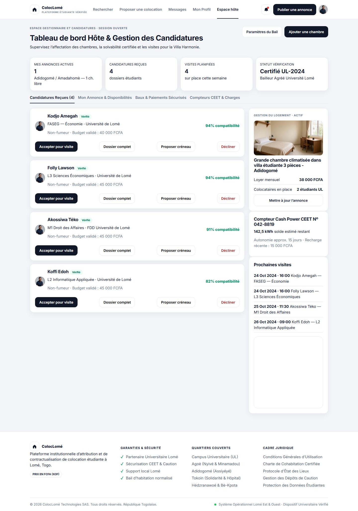
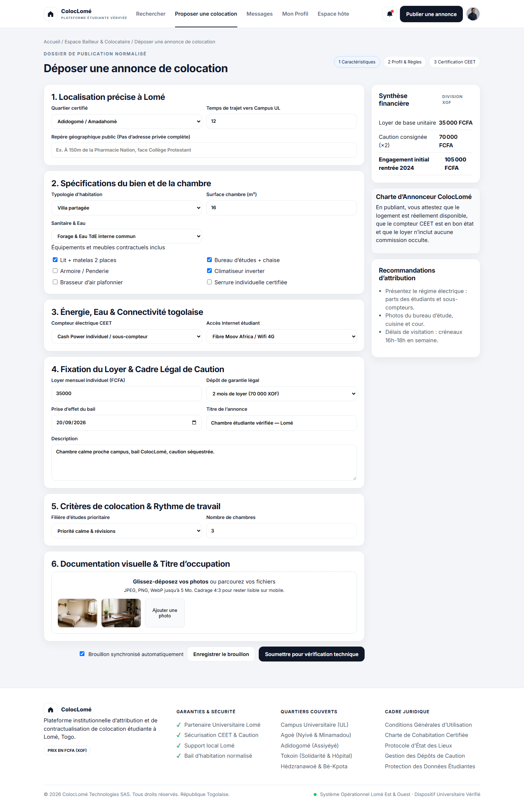
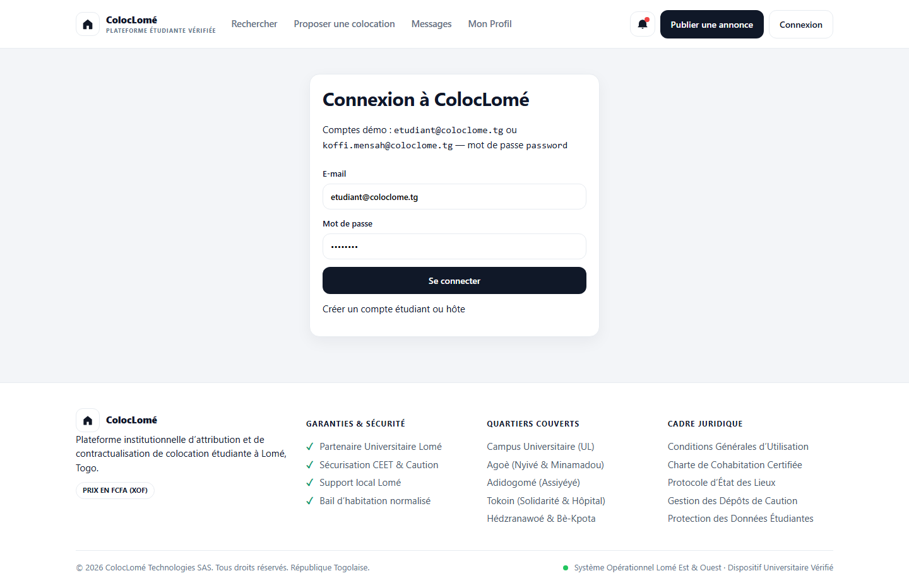

# ColocLomé

<p align="center">
  <a href="#fr">Français</a>
</p>

<a id="fr"></a>

Plateforme web de **colocation étudiante vérifiée à Lomé** : recherche de chambres, matching de compatibilité, messagerie sécurisée, visites encadrées, publication d’annonces et gestion des candidatures — avec un cadre local (FCFA, CEET Cash Power, campus UL / FSS / FDD).

## Sommaire

- [Aperçu](#aperçu)
- [Fonctionnalités principales](#fonctionnalités-principales)
- [Stack technique](#stack-technique)
- [Architecture](#architecture)
- [Captures d’écran](#captures-décran)
- [Installation locale](#installation-locale)
- [Configuration](#configuration)
- [Lancement en développement](#lancement-en-développement)
- [Base de données](#base-de-données)
- [Comptes et rôles](#comptes-et-rôles)
- [Routes principales](#routes-principales)
- [Sécurité et permissions](#sécurité-et-permissions)
- [Structure du projet](#structure-du-projet)
- [Roadmap](#roadmap)
- [Licence](#licence)

---

## Aperçu

**ColocLomé** est une application full-stack PHP (MVC) + MySQL conçue pour :

- permettre aux **étudiants** de chercher une chambre vérifiée près de leur campus, de postuler et de suivre visites et messages ;
- permettre aux **hôtes / bailleurs étudiants** de publier une annonce, d’examiner les dossiers et de planifier les visites ;
- réduire l’opacité locative à Lomé : zéro commission d’agence informelle, baux normalisés, caution séquestrée, charges CEET explicites ;
- offrir une interface moderne, **responsive mobile-first**, prête à être présentée en entretien ou en démonstration.

Le projet est orienté usage réel : workflow par rôle, CSRF, sessions, données de démo Lomé, et écrans calés sur des maquettes produit.

---

## Fonctionnalités principales

### 1) Authentification et profils

- Inscription / connexion / déconnexion (sessions PHP).
- Rôles applicatifs :
  - `student`
  - `host`
- Profil enrichi : établissement, filière, matricule UL, avatar, statut vérifié.
- Accès rapide vers l’espace étudiant (candidatures) ou l’espace hôte.

### 2) Accueil et recherche

- Hero avec image, message produit et CTA (trouver une colocation / proposer une chambre).
- Filtres : quartier, budget FCFA, accessibilité campus, Cash Power, fibre, rythme de vie.
- Score de compatibilité, cartes d’annonces, charte de sécurité (pas de Mobile Money avant bail).
- Questionnaire de préférences (quartier, budget, rythme, faculté).

### 3) Fiche logement

- Galerie, fiche technique, équipements, description.
- Répartition des charges CEET (fixe vs Cash Power variable).
- Critères de cohabitation, carte, synthèse financière (loyer × 12 + caution).
- Candidature / demande de visite.

### 4) Messagerie et visites

- Conversations liées à une annonce.
- Fil de discussion, pièces jointes (prévues), rappels de protection étudiante.
- Bannière de visite (créneau, lieu public, code), confirmation de présence.
- Indicateurs : loyer, caution, distance campus.

### 5) Candidatures étudiant

- Suivi des dossiers (en cours, visite, accepté, non retenu).
- Confirmation de créneau, protocole de visite sécurisée.

### 6) Espace hôte

- Tableau de bord : annonces, candidatures, visites, statut de vérification.
- Actions : accepter pour visite, décliner.
- Suivi logement, compteur Cash Power, agenda des visites.

### 7) Publication d’annonce

- Localisation Lomé, surface, énergie CEET, loyer et caution légale.
- Synthèse financière automatique, dépôt pour vérification technique.

---

## Stack technique

### Backend

- PHP `8.2+` (testé en `8.4`)
- Architecture **MVC** maison (front controller, routeur, contrôleurs, modèles PDO)
- Sessions + authentification + CSRF

### Frontend

- HTML / CSS / JavaScript (sans framework)
- Interface responsive mobile-first (menu hamburger &lt; 1024px)
- Cartes Leaflet/OpenStreetMap pour le contexte géographique

### Base de données

- MySQL `8.x`
- Schéma + jeu de données de démonstration (`database/schema.sql`)
- Amorçage automatique si la base est vide

---

## Architecture



### Cœur applicatif

- `App\Core\Router` : routes déclaratives (`config/routes.php`)
- `App\Core\Database` : PDO, création de la base, seed si tables vides
- `App\Core\Auth` : session, rôles `student` / `host`
- `App\Core\Controller` : rendu de vues, redirections, CSRF sur POST

---

## Captures d’écran

Aperçu réel de l’application (captures générées depuis l’instance locale) :



















Pour régénérer les captures (Chrome installé, serveur local lancé) :

```bash
npm install
npm run screenshots
```

---

## Installation locale

### Prérequis

- PHP 8.2+ (CLI + extension PDO MySQL)
- MySQL 8 (WAMP, XAMPP ou service autonome)
- Un navigateur moderne
- (Optionnel) Node.js 18+ uniquement pour régénérer les captures

### Étapes

```bash
# 1) Se placer dans le projet
cd C:\Users\ElonMusk\Desktop\COLOC

# 2) Démarrer MySQL (WAMP : icône verte / service MySQL)

# 3) Vérifier config/config.php (utilisateur / mot de passe MySQL)

# 4) Lancer le serveur PHP intégré
php -S 127.0.0.1:8080 -t public public/router.php
```

Ouvrir **http://127.0.0.1:8080**

À la première requête, l’application crée la base `coloclome` et charge les données de démo si elle est vide.

### Variante Apache (WAMP)

1. Copier le projet dans `C:\wamp64\www\COLOC`
2. Démarrer Apache + MySQL
3. Ouvrir `http://localhost/COLOC/public/`

Si les URLs internes renvoient 404, activer `mod_rewrite` ou rester sur `php -S`.

---

## Configuration

Fichier : `config/config.php`

| Clé | Défaut | Description |
|---|---|---|
| `app.url` | `http://localhost/COLOC/public` | URL de base (les liens se calculent aussi depuis le script) |
| `db.host` | `127.0.0.1` | Hôte MySQL |
| `db.port` | `3306` | Port |
| `db.name` | `coloclome` | Nom de la base |
| `db.user` | `root` | Utilisateur |
| `db.pass` | *(vide)* | Mot de passe MySQL |

Installation manuelle du schéma :

```bash
mysql -u root -p < database/schema.sql
```

Ou une fois : `http://127.0.0.1:8080/install.php` puis supprimer ce fichier.

---

## Lancement en développement

```bash
php -S 127.0.0.1:8080 -t public public/router.php
```

Laisser le terminal ouvert. Si le port 8080 est pris :

```bash
php -S 127.0.0.1:8081 -t public public/router.php
```

---

## Base de données

Tables prévues :

- `users`, `neighborhoods`
- `listings`, `listing_photos`
- `conversations`, `messages`
- `applications`, `visits`

Jeu de démo : 8 utilisateurs, 5 quartiers, 5 annonces, conversations, candidatures et visites (Adidogomé, Agoè-Nyivé, Tokoin, campus UL).

Réimporter à zéro :

```bash
mysql -u root < database/schema.sql
```

---

## Comptes et rôles

Mot de passe commun de démo : `password`

| Rôle | E-mail | Accès |
|---|---|---|
| Étudiant | `etudiant@coloclome.tg` | Recherche, messages, candidatures, préférences |
| Hôte | `koffi.mensah@coloclome.tg` | Tableau de bord hôte, publication |

Autres profils seed : Folly Lawson, Akossiwa Téko, Koffi Edoh (étudiants) ; Afiwa Dossou, Messan E., Babatoundé T. (hôtes).

---

## Routes principales

### Public

- `GET /` — accueil
- `GET /recherche` — résultats + filtres
- `GET /logement/{id}` — fiche annonce
- `GET /connexion` · `POST /connexion`
- `GET /inscription` · `POST /inscription`

### Authentifié

- `GET /profil` · `POST /deconnexion`
- `GET /messages` · `GET|POST /messages/{id}`
- `GET /preferences` · `POST /preferences`

### Étudiant

- `GET /candidatures` · `POST /candidatures`
- `POST /visites/{id}/confirmer`

### Hôte

- `GET /hote` · `POST /hote/candidatures/{id}`
- `GET /publier` · `POST /publier`

---

## Sécurité et permissions

- Jeton CSRF obligatoire sur tous les POST.
- Pages hôte / étudiant protégées par rôle (`Auth::requireRole`).
- Requêtes SQL préparées (PDO).
- Échappement HTML (`e()`) dans les vues.
- Rappel métier : aucun versement T-Money / Mixx avant bail normalisé.

---

## Structure du projet

```text
COLOC/
  app/
    Core/            Router, Database, Auth, View, Controller, Model
    Controllers/
    Models/
    Views/           layouts, partials, pages
  config/            config.php, routes.php
  database/          schema.sql
  public/            index.php, router.php, assets/
  docs/
    images/          captures d’écran
    capture.cjs      script de génération des captures
    linkedin-post.md
```

---

## Roadmap

- Paiement / séquestre de caution (API mobile money encadrée).
- Upload réel des photos et pièces (CNI, carte étudiant).
- Notifications temps réel des messages.
- Tests automatisés (PHPUnit) et parcours E2E.
- Déploiement (Apache/Nginx + HTTPS).

---

## Licence

Projet pédagogique / démonstration. Tous droits réservés à l’auteur, sauf mention contraire.
